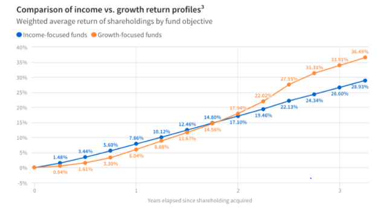
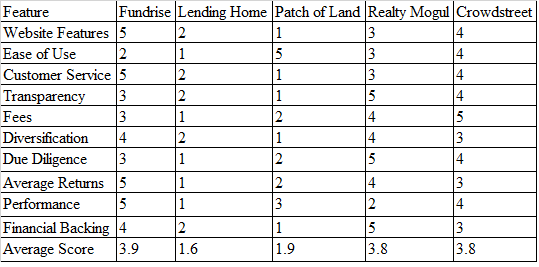

# Fintech_case_study on Fundrise - A CRE Investment Platform

## About the Industry

There are 4 primary types of real estate - land, industrial, residential, and commercial. Commercial is he broadest type of real estate and there are many sub-categories within the CRE category.

•	**Commercial Real Estate** is defined as any property owned to produce income. It is any kind of property, including land, which brings or has the potential to bring income. CRE is any offering of office, retail, industrial, medical, hospitality, and other commercial space that can be leased (and sometimes bought) for the use of the business. Commercial properties can be classified into six main categories: office, retail, industrial, multi-family, land, and a miscellaneous catch-all category that includes everything else.

•	**Office Properties** include single-tenant buildings, small professional buildings, skyscrapers, and everything in between. They can be classified among three different classes, ranging from A to C, A being the best properties in the market. Investors usually target the Class B type properties. These are not restricted to metropolitan areas; suburban office buildings dot the landscape everywhere there are residences to support them.

•	**Retail/Restaurant sites** can be freestanding, like a bank or restaurant building. These are often found on the lower floors of office buildings or multi-family structures, especially in urban areas. Businesses can pinpoint their ideal retail space from any of these options, but investors will be drawn to malls and retail centers, which have many tenants and therefore are a better risk.

•	**Industrial properties** range from smaller sites that are often termed "flex" space or "R&D" properties; to warehouses; to large, heavy manufacturing sites. These spaces are often listed with clear height specifications, or the height from the floor to the lowest-hanging overhead obstruction, which could be 14 feet in a small building to more than 40 feet in a large industrial space. Businesses seeking industrial space also look for dock types and availability. Some industrial spaces lend themselves more to investment opportunity. Heavy manufacturing sites are very specialized with machinery, and cannot be easily transformed for another use. These sites often house a single tenant, making them a poor investment bet, in general. Bulk warehouse space is also fairly specialized, and not easily transformed. Light assembly industrial space, on the other hand, can be easily converted to office space or another commercial use. Flex warehouse sites are also easily reconfigured, and often provide a mix of warehouse and office space for businesses seeking this combination. These latter two types of industrial space have become increasingly popular as "flex" office space, and can represent a good investment option.

•	**Multi-family structure type** include, garden apartments, which sprung up throughout the nation in the 60's and 70's. These are three to four story structures without elevators and with surface parking. Midrise apartment complexes are between 5 to 9 stories with an elevator, and are often found in urban infill spots. High-rise apartment complexes generally have more than 100 units, and are professionally managed. An apartment fourplex or larger is considered commercial real estate for an investor. Sprawling apartment complexes, high-rise condominium units, and smaller multi-family units are all CRE investments. Leases on multi-family structures are shorter-term than office and retail units, however, providing less long-term stability than office building investments.

•	**Land** is usually favored by investors, especially those in the path of future development. Greenfield land is undeveloped land--pasture just waiting to be paved. Urban infill is usually land that was once developed, and now is vacant. Brownfield land describes previously developed property that is often environmentally compromised, requiring significant clean-up to be utilized. Brownfield and urban infill land are more highly prized by environmentally-conscious investors.

•	**Everything Else** includes, Leisure (hotels, public houses, sports facilities, etc.) and healthcare (medical centers, hospitals, and nursing homes) could arguably have their own categories, as there are many of these. Other retail offerings include car washes, theme parks, self-storage, bowling alleys, marinas, theaters, and funeral homes. All of these fall into the CRE category for both space-seeking businesses and for investors.

## About the Company

**Fundrise** is a Washington, D.C.-based financial technology company founded in 2010 by brothers Ben and Dan Miller. Fundrise has been labeled as the first company to successfully crowdfund investment into the real estate market. The minimum investment amount is $500 and they make it very similar to investing in a mutual fund.

Fundrise an investment service that allows you to invest directly in commercial real estate. The company created a marketplace that is fairly transparent and their goal is to "make the process of investing in the highest quality commercial real estate from around the country simple, efficient, and transparent." Essentially, they bridge the gap between the investor and the developer.

Traditionally, investing in real estate is not direct to the investor and there are many middle men. Fundrise and similar companies are trying to avoid the middle man and with that reduce the overhead expenses.

### Investing through Fundrise

**Crowd Funding**

Fundrise is the first company to adapt crowd funding in CRE sector. Crowd funding is where investors pool in the money to invest in to a security or any other type of investment. Real Estate Crowdfunding is simply a way to take the investment capital of a lot of different investors, pool the funds, and buy a real estate asset with those funds. The investors then receive a distribution of the earnings throughout the holding period of the investment. They also receive their portion of the appreciation upon sale. In real estate this is generally called syndication, but with the JOBs act and new crowdfunding rules, money can be solicited online and openly. In the past, it had to be done privately and without any open advertising. Since these offerings are technically securities, not much different than a stock, they are regulated by the SEC. In order to be compliant with the SEC regulations, companies such as Fundrise can use one of two primary ways to raise money.

1.	Crowd funding for accredited investors with 506(c)

The SEC put out regulation D and it has several exclusions to allow capital raisers to get the capital without filing the paperwork to go public. The traditional way is with 506(b) which allows them to raise capital from an unlimited number of accredited investors and up to 35 non-accredited investors.

2.	Regulation A+ for non-accredited investors

Regulation A+ allows the company to raise up to $50m to invest. Due to the size of these offerings, there is a high cost to set these up. Because the costs are high, all of the offerings are structured in a REIT style.

But, both accredited and non-accredited investors can participate. The only caveat is that a non-accredited investor is generally capped at investing up to 10% of their net-worth or their income, whichever is greater.

Investors can expect a quarterly dividend payment from the Fundrise eREITs and whatever appreciation has accrued when the assets investment term has expired. There are currently 9 different eREITs that the company have, some of which are stabilized and no long accepting new investors. While investing, an investment strategy can be chosen and Fundrise will distribute the investment across the eREITs to diversify the money.

**Why CRE is a good investment?**

The biggest reason even to invest is CRE is income. In CRE, even the price of the building is determined entirely on the income it provides, not on what other properties are selling for. The second biggest reason to have commercial real estate as an investment is because of appreciation. Since price is determined by the income, anything that increases income will increase its value. This is called forced appreciation.

**Who are the investors?**

A few years ago Fundrise was for accredited investors only. The SEC released Regulation A which made things available to unaccredited investors, but it was too complicated so most sites used Regulation D instead, which excludes unaccredited investors.

The SEC, in March 2016 and released Regulation A+ which further simplifies the process for the unaccredited investors to invest. Fundrise really has been the pioneer in this area and being one of the first to use Regulation A+ to bring online offerings to the masses.

Now, Fundrise is open to non-accredited investors and people with net worth of less than $1M can also invest in passive real estate investments.

**Company’s Underwriting process to find and screen investments**

Fundrise’s approval stats stand at 1% in every 250 submissions, and, all of this in just a week. At present, the company has 217 active projects and 69 completed projects.

1) **Sponsor Screening**

The first thing they look at is the company and the sponsors. They look only for companies that are well capitalized and have a history of success in top US markets. They claim that only 25% of sponsors move beyond this step.

2) **Initial Project Due Diligence**

Fundrise is focused on short-term projects that last 1-3 years. Their preferred structure is Senior Secured Debt, Mezzanine Debt, or Preferred Equity. Fundrise investors are senior to the sponsor and "Fundrise investors must get paid back their principal and any owed returns before the company is able to realize any profits."

3) **Detailed Underwriting**

If the sponsor and project meet the Fundrise requirements, it moves on to the detailed underwriting. The Fundrise underwriting team completes an extensive analysis and review of all these points. The total underwriting checklist contains more than 350 different data points.

4) **Purchase by Fundrise**

So Fundrise actually funds the deal before putting it on the platform. By pre-funding the deal, they take on a large amount of risk that this project will be good and investors will want it.

**How to invest with Fundrise**

As Fundrise follow crowd funding, when any investor starts investing through Fundrise, there are three different investment objective based categories, income, balanced, and growth.

Fundrise is unique with the fact that you don't actually choose specific projects to invest in. Instead, you choose an investment style and Fundrise helps choose a portfolio allocation across their investments.

By choosing one of their options, Fundrise will suggest an allocation. You can choose if you're focused on current income, future potential, or a balance of the two, which have different eREITs investing all over the country.

**Risks associated with REIT investments**

A REIT has a lot of requirements in order to qualify and it needs to distribute 95% of its taxable income to the shareholders. There are also different types of REITs, such as a publicly listed REIT, non-listed REITs. These eREITs offered by fundrise are non-traded REITs as they are not listed or traded on the stock exchange. According to FINRA, there are a number of risks associated with non-traded REITs, the biggest of which is that it can be very difficult to get your principal back. Other issues are potentially high fees, especially on the front-end and a limited secondary market to sell your shares.

**Redemption of Fundrise eREIT shares**

First, Fundrise will only redeem a certain amount of shares per quarter. Once they have redeemed those shares, you will get in line for the following quarter, and so on. Additionally, when you redeem the shares, you will incur a penalty of between 3 and 5% of the share price. Thirdly, Fundrise gets to calculate the value of the shares.

**Historical performance of the company**

By pursuing a private market, direct investment strategy, Fundrise portfolios earn higher annual current income than public income-focused investments. The figure shown here represents the currently declared dividends for the Fundrise Supplemental Income portfolio as compared to public REIT ETFs and public bond ETFs.

 
In 2019, Fundrise produced a total net platform return of approximately 9.47%. But in many ways using a singular weighted average figure to represent the entirety of the platform’s performance oversimplifies the actual diverse experience of our investors on Fundrise, as well as the fundamentals of how investing in real estate actually works.

At the end of 2019, Fundrise had more than 120,000 active investors. Those investors ranged from having spent as little as one day on the platform to more than five years. Collectively, they invested in portfolios composed of as many as 16 different eREITs and eFunds, as well as many project dependent notes (the predecessor of the eREITs), with investment objectives ranging from generating consistent income, to maximizing long-term growth, to a balanced blend of each. As a result, nearly every one of our investors had a unique return for their Fundrise portfolio based on their specific set of individual circumstances.

An investor’s unique return for the year was highly correlated to the amount of time they’d been investing with Fundrise.

 

Historically, the return on investment for Fundrise investments has been following J-curve. A “J” curve investment is an investment that follows a pattern where realized returns tend to be lower — or even negative — in the early period of the investment, often as a result of both money and time being invested into creating value, with the majority of the return on that capital and work realized towards the later portion of the investment period.

**Comparing growth and income focusing portfolios:**

In real estate, income-focused investment strategies typically consist of either buying already-stabilized properties which generate regular income through rent, or by providing financing via a loan or other debt-like structures to the developer of a property, who then pays regular fixed interest payments.

Once the capital has been deployed, you would expect an income-focused investment to earn returns in a more or less straight line compared with a growth-focused investment. The important part to note is that, like a growth-focused investment, deploying the capital does not happen overnight. It takes time to identify the right investment, perform due diligence, and close. In the case of investments in construction, they are typically funded in draws, meaning that a portion of the capital is not deployed until certain construction milestones are reached.

 

Investing in real estate on Fundrise is a lot more like investing into a portfolio of companies that are still in their high-growth pre-IPO phase than it is like owning an index of mature, publicly traded companies.

A large portion of any returns comes directly from the value added to the property. Because performance is so much more closely tied to the properties and execution of their business plans, it follows a natural trajectory in the form of a J-curve that takes time to play out: an initial period of low expected returns as properties are acquired and business plans put into action, with a potential harvesting of the value creation in the form of higher returns in the later portion of the investment period.

Therefore, Fundrise investors should not only expect for returns to be lower than the platform average if they’re in their first year or two of their journey with us, but if they’re like us and like to think long-term, they might actually get excited about owning a portfolio that is heavily weighted towards properties that are in this early “incubation period” where we are building up the potential for higher returns in the future.

**Why investing in real estate with fintech makes sense**

Real estate fintech – or financial technology – gives investors a way to cut out the middle man in real estate transactions. There’s less friction, lower costs, and increased investment opportunities throughout the entire process of real estate acquisition, leasing and asset management, and property disposition.

Amazon, Uber, Airbnb, and SharesPost are changing the way we shop, travel, vacation, and invest. In a similar manner, real estate fintech and fractional property ownership are revolutionizing the world of real estate investment.

Investing large amounts of capital directly in a single property can create an unnecessarily high level of risk. Today, digital shares allow real estate investors to diversify and grow their portfolios by owning small slices of investment-grade, income-producing commercial real estate throughout the U.S. and Canada. Transactions are transparent, fees are significantly lower, and digital shares of real estate are liquid during the life of each investment.

Over the past 10 years, global investment in real estate fintech startups skyrocketed from $2.2 billion to $31.3 billion, according to a recent report by Deloitte.

**Impact of FinTech on the Commercial Real Estate Market**

The Fundrise mission is to “reinvent the way people invest their money.”

Globally, technology is rapidly transforming the financial sector. One of the many financial services industries impacted by FinTech is commercial real estate (CRE). With an ever-growing population, commercial real estate is becoming increasingly important as every office property, shopping mall and skyscraper owes its existence to CRE lender capital. Much like tech companies have disrupted consumer lending, technology is slowly transforming the CRE market.

There are numerous factors leading this change in commercial real estate including new business models and competition, changing expectations of tenants and investors, and extensive use of technology. According to Deloitte research, real estate fintech startups across the world increased by 18 per cent between 2008 and 2019. VC firms and non-VC investors both have been heavily investing in such startups. Technology now plays a role in every aspect of the CRE sector. Companies are beginning to adopt technologies. However, the pace of doing so is slower than that of other industries. According to a Deloitte survey in 2018, close to 53 per cent of respondents believed that technological advancements will have the greatest impact on legacy properties within the next three years, and 15 percent believe that the impact is already becoming visible. Investors also have certain expectations about technology usage from their CRE investments. Over 80 per cent of Deloitte’s survey respondents believe that CRE companies should focus on the use of predictive analytics and business intelligence.

1.	**Rise of crowd funding**

Crowdfunding pulled technology to the forefront in an industry that has typically relied on ‘old school’ methods for raising capital. Some crowdfunding firms have updated their models to offer both equity and debt financing for developers and sponsors. At the same time, there have been other FinTech firms that have entered the space as direct lenders and financial intermediaries.

2.	**Simpler commercial real estate lending**

Similar to how peer-to-peer lending has changed consumer loans, advancements in financial technology have led to a number of new alternatives for those seeking CRE loans. As a result, CRE financing has been optimized. FinTech has accelerated CRE lending and associated processes. Previously, the loan application process took several weeks. Now, however, it takes a few minutes of paperwork followed by one to two business days to get an answer from the lender. In addition, the due diligence now requires less time as well. By utilizing technologies like artificial intelligence (AI) and blockchain, FinTech has made CRE simpler and more transparent. AI algorithms go through large data pools faster than humans, reducing errors in the process. Similarly, blockchain enhances security which allows sellers and buyers to operate with more confidence.

3.	**Blockchain**

Commercial real estate owners have an opportunity to alleviate some of the existing challenges in their leasing transactions using blockchain technology:

•	Inefficient property search process due to fragmented listings data

•	Time-consuming, paper-driven, predominantly offline due-diligence process

•	Complexity in managing ongoing lease agreements, property operations, and cash flows

A typical blockchain involves six steps: first, two parties exchange data; second, nodes verify the transaction this entails, based on rules established by the network; third, verified transactions are bundled together into a block; fourth, the block must then be validated via a consensus mechanism; fifth, miners try to “solve” the block; finally, the block is distributed throughout the network as another link in the chain.

Smart contracts using block chain technology to execute real estate leases helps ease the problems related to property and cash flow management. This would also help increase transparency and allow automated payments. Commercial mortgage is typically closed in 3 months and finance approvals require a great deal of paperwork. Blockchain reduces the need for this paperwork and makes the process run smoother by simplifying financing processes. It also helps reduce due diligence and documentation times, along with data integrity concerns. The execution of smart contracts on blockchain platforms would provide all benefits of blockchain, including a series of complete, immutable, and traceable records, offering audit trails of transactions such as ownership history, property cash flows, and mortgage payments. The buyer could also track the mortgage in real time.

4.	**Data**

If real estate is an information game, then the future of real estate is a data game. One simple explanation for data is that it’s knowledge that is too big, too detailed, or too complex. Using a larger set of information to make key business decisions is an advantage vs those who make decisions only based on their personal knowledge.

**Why should companies focus on real estate Fintech startups**

Real estate tech startups can be categorized in to two groups

1.	RE operations

The operations-related tech startups focus on the core real estate business such as property search, leasing, facility management, smart building technologies, and home services.

2.	RE Fintechs

They offer diverse services and solutions such as real estate transaction services, digital lending platforms for construction and real estate owners and lenders, online real estate investments options for individuals, or investments in single-family homes for institutional investors.

**How to benefit from RE fintechs?**

There are many ways in which traditional real estate companies can benefit from the solutions offered by RE fintech firms. They can provide platforms that can expand and diversify the lender base and enable more individuals and institutions to get exposure to real estate.

**Where should companies start?**

Traditional real estate companies can benefit by engaging with these startups in different ways. Companies can make choices based on their investing capacity, the utility of a startup’s services, their need for financing, and so forth. As end users, real estate companies can leverage some of the online services and solutions for key property-related decisions.

**RE fintechs’ services**

Construction and real estate owners, developers, and investors can use RE fintech platforms for a variety of services – including leasing, acquisition, disposition decisions, and managing the underwriting process, and accessing detailed financial models for property financing.

**Fintech advancements at Fundrise**

**Real Estate Robo Advisors**

Fundrise 2.0 was just announced, and while their eREITs are still the underlying investment vehicles, they’ve shifted the investor experience to one more akin to present day robo advising.

**Pros and Cons of Investing with Fundrise**

**Pros**

•	Low minimum investment.

•	Open to all investors.

•	Easy-to-use website.

•	IRA accounts available.

**Cons**

•	Non – traded REITs - Highly illiquid investment

•	Fees can be difficult to understand.

•	Complex investments that require investor due diligence.

•	Redemption: Fundrise offers a redemption program that allows investors to sell shares back to Fundrise for a fee. That fee, which is paid into the eREIT or eFund, is calculated as a reduction to the share price value: 0% if in the first 90 days; 3% reduction if the shares were held at least 90 days but less than three years; 2% if shares held at least three years but less than four years; 1% if shares held at least four years but less than five years. There’s no share-price reduction to redeem shares held five or more years.

**Baseline**

**Investing through Fundrise is better option for:**

1.	Investors with long term vision

2.	Investors who want to diversify out of stocks

3.	Risk takers

4.	Those who want to learn about new investments

**Comparing to competitors**

According to investorjunkie.com:

 
**Things done differently by the company to keep up in the race:**

**90-Day Guarantee**

First is the 90-day satisfaction period.
If you’re not completely satisfied with your investment, just let Fundrise know within the first 90 days and they’ll buy your original investment back for its original amount.

**Optional Upgrade to Premium Plan**

The second incredible feature that the Starter Portfolio offers is the option to upgrade to a premium plan for free. Once you’ve invested a minimum of $1,000 with Fundrise through the Starter Portfolio, you can upgrade to one of the previously mentioned plans absolutely free. The Starter Portfolio is a smart option for anyone new to real estate investing that doesn’t have a large amount of cash up front.

**Summary of Fundrise platform**

**Sources**

[Company Website - Performance](https://fundrise.com/historical-performance)

[Company Website - Hostorical Returns](https://fundrise.com/education/blog-posts/understanding-fundrise-historical-returns)

[Company Website - How it Works](https://fundrise.com/how-it-works)

[SEC](https://www.sec.gov/Archives/edgar/data/1645583/000114420415068128/v425704_253g2.htm)

[Deloitte](https://www2.deloitte.com/content/dam/Deloitte/au/Documents/Real%20Estate/deloitte-au-dre-companies-focus-real-estate-fintech-start-ups-220218.pdf)

[Investopedia - Commercial Real Estate](http://www.investopedia.com/terms/c/commercialrealestate.asp)

[Investopedia - Fintech in Real Estate](https://www.investopedia.com/investing/fintech-real-estate/)

[The Balance](https://www.thebalance.com/what-is-commercial-real-estate-3305914)

[42floors](https://42floors.com/edu/basics/what-is-commercial-real-estate-the-definition-of-cre)

[Property Metrics](http://www.propertymetrics.com/blog/2013/02/27/types-of-commercial-real-estate/)

[Medium - Commercial Real Estate History](https://medium.com/commercial-real-estate-daily/commercial-real-estate-history-community-424447281945)

[Medium - Impact of Fintech on Commercial Real Estate](https://medium.com/@valustrat/how-will-fintech-impact-the-commercial-real-estate-market-4bb9f3d5e1ff)

[Movoto](https://www.movoto.com/blog/tips-how-tos/real-estate-tips/real-estate-through-time-infographic/)

[Ideal REI](https://idealrei.com/blog/fundrise-review#tab-con-8)

[Twin Rock Partners](https://www.twinrockpartners.com/why-investors-are-focusing-on-real-estate-fintech/)

[All abot Alpha](https://www.allaboutalpha.com/blog/2019/05/09/a-fintech-revolution-in-commercial-real-estate/)

[Stack Souce](https://blog.stacksource.com/whats-hot-in-real-estate-fintech-b8f5b3649ee)

[Nerd Wallet](https://www.nerdwallet.com/reviews/investing/brokers/fundrise)

[Investor Junkie](https://investorjunkie.com/real-estate/p2p-real-estate-crowdfunding-comparison/)

[Money done Right](https://moneydoneright.com/fundrise-review/)

